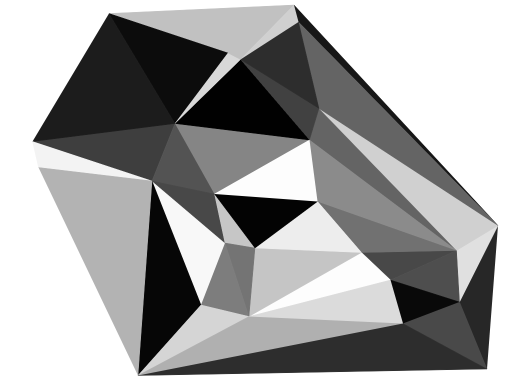

A simple image and point set triangulation using Delaunay 
=========================================================

Written in Javascript (with HTML5 Canvas).

 Live demo at http://int2byte.de/public/image-triangulation/main.html
 