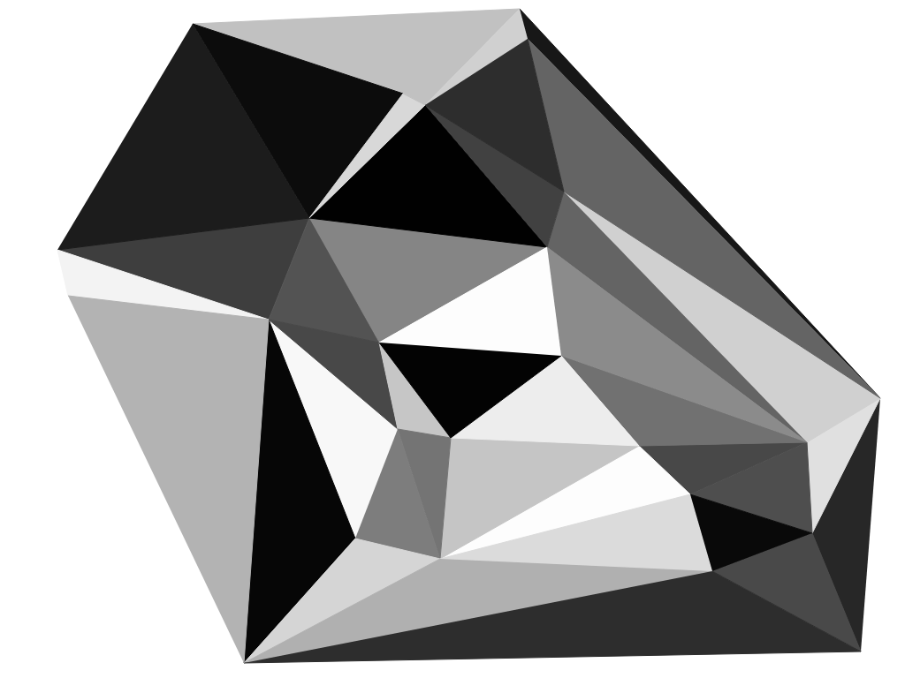
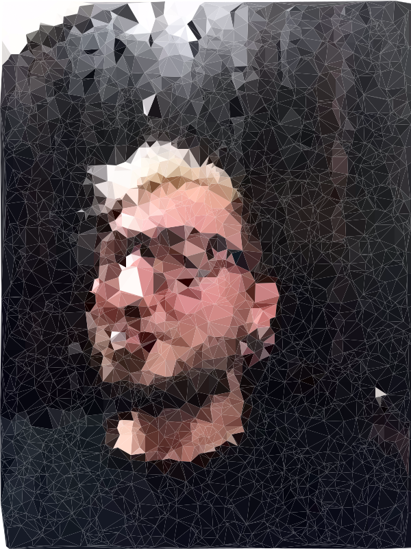
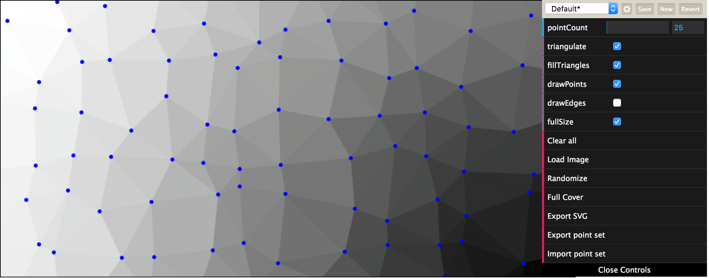
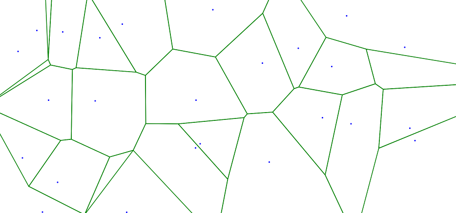
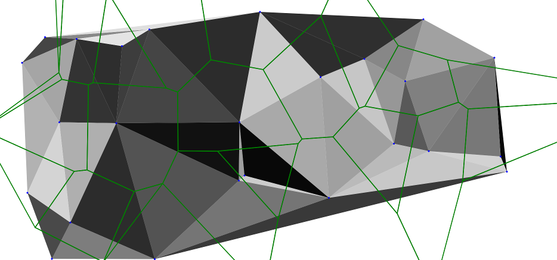
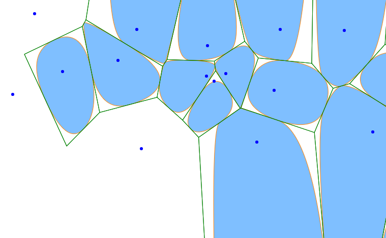
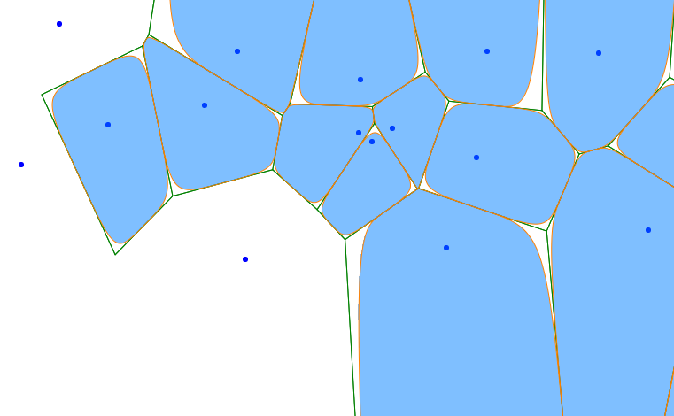
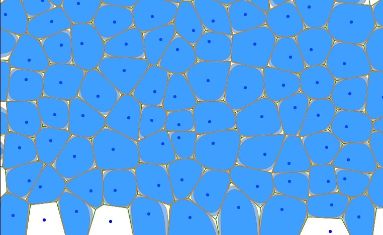

# A simple image and point set triangulation using Delaunay 

Written in Javascript (with HTML5 Canvas), inspired by the delaunay triangulation algorithm found at
http://www.travellermap.com/tmp/delaunay.htm

Feature list
 * Random point set.
 * Triangulate point set.
 * Use triangulation colors from image.
 * Export SVG images.
 * Export vertex list (JSON file).
 * Import vertext list (JSON file).
 * Since version 1.0.1 there is also a Voronoi-from-Delaunay computation.
 * Version 1.0.3: Voronoi cells from quadratic bezier curves.
 * Version 1.0.4: Voronoi cell from cubic bezier curves.

## Changelog
 * v1.0.7
	* Added a better mouse handler.
	* Added documentation for the Triangle class.
	* Removed all usage of jQuery (library still in the package).
 * v1.0.6
	* SVG export now also supports cubic Bézier Voronoi cells.
 * v1.0.5
	* SVG export now also supports quadratic Bézier Voronoi cells.
 * v1.0.4
	* Added quadratic voronoi cells.
 * v1.0.3
	* Added the Polygon class.
 * v1.0.2
	* Minor code changes.
 * v1.0.1
	* Added the option to draw circumcircles.

## Todos:
 * Remove jQuery? (it's not really required here).
 * There are voronoi errors (cannot build) when points a too close.
  * Add a good tap handler.	   

## Screenshots

It is also safe to add vertices outside the bounding box (when load via JSON).

See the Voronoi diagram (still experimental)

See the Voronoi cells from (a) quadratic and (b) cubic bezier curves:

More cells:

Live [demo here](http://int2byte.de/public/image-triangulation/main.html "Demo here")

Credits to Joshua Bell who wrote the C++ code which was later ported to Javascript.
[codeguru](http://www.codeguru.com/cpp/data/mfc_database/misc/article.php/c8901/)