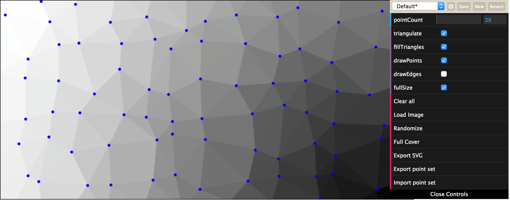
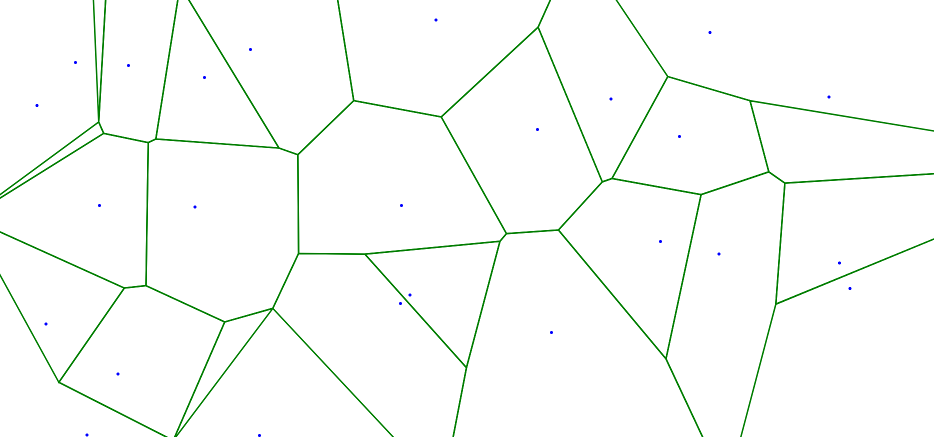
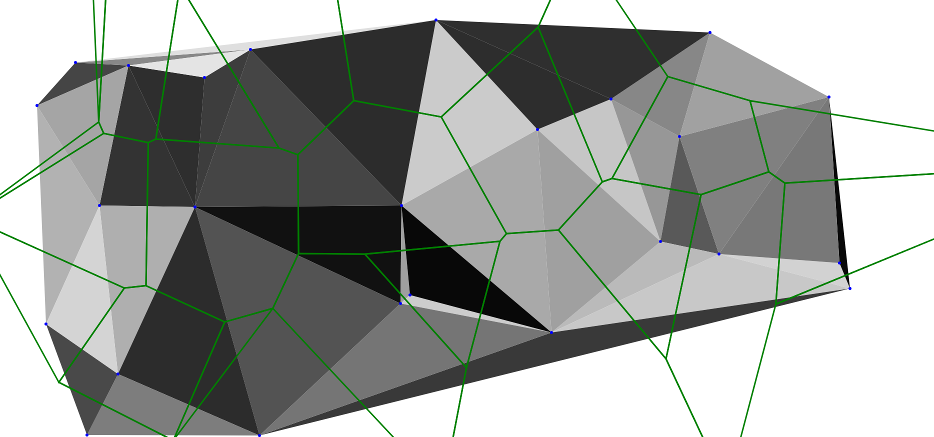

A simple image and point set triangulation using Delaunay 
=========================================================

Written in Javascript (with HTML5 Canvas), inspired by the delaunay triangulation algorithm found at
http://www.travellermap.com/tmp/delaunay.htm

Feature list
 * Random point set.
 * Triangulate point set.
 * Use triangulation colors from image.
 * Export SVG images.
 * Export vertex list (JSON file).
 * Import vertext list (JSON file).

 * Since version 1.0.1 there is also a Voronoi-from-Delaunay computation.

It is also safe to add vertices outside the bounding box (when load via JSON).

See the Voronoi diagram (still experimental)

Live [demo here](http://int2byte.de/public/image-triangulation/main.html "Demo here")

Credits to Joshua Bell who wrote the C++ code which was later ported to Javascript.
[codeguru](http://www.codeguru.com/cpp/data/mfc_database/misc/article.php/c8901/)